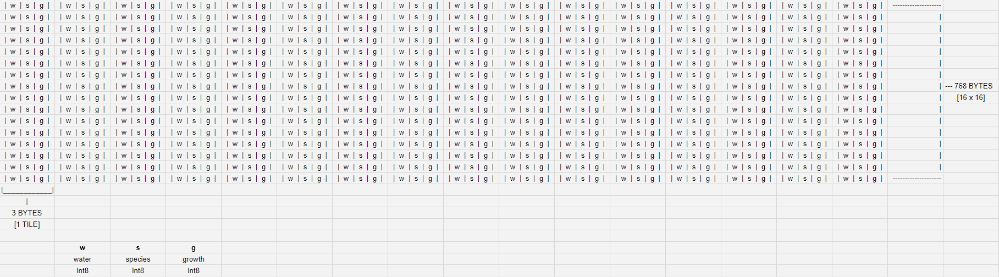

# Devlog Entry - [11/18/2023]

## Introducing the team

- Sean is the tools lead, choosing all the tools we will be using, and making sure that everyone is using those same tools, and is up to date on those tools.
- Miles is the design lead, taking the responsibility of game direction and feel. The initial plan is an ascii art game.
- Cameron is Engine Lead, focusing on overall code structure and implementing - features
- Calex will take the role of Production Lead, ensuring that people are organized and know their deadlines and tasks, keeping us on track to meet targets, and turning in assignments

## Tools and materials

With about one paragraph each...

Tell us about what engines, libraries, frameworks, and or platforms you intend to use, and give us a tiny bit of detail about why your team chose those.

- We plan on starting the project using raw Typescript and HTML, and possibly moving to phaser if we need more of an engine library. We were thinking we could make a cool ASCII art game akin to Universal Paper Clips, and to do so we wouldn’t need any heavy duty graphics libraries. We plan to pivot to Phaser if our design direction changes down the road. We chose to work in Typescript because it is a language we have grown accustomed to over the quarter and will be easy to port to Phaser if need be.

Tell us programming languages (e.g. TypeScript) and data languages (e.g. JSON) your team expects to use and why you chose them. Presumably you’ll just be using the languages expected by your previously chosen engine/platform.

- We plan on using TypeScript and JSON, we chose them because we plan on making a very basic game with ASCII art and buttons, and we feel TypeScript suits these ideals for our design very well.

Tell us about which tools you expect to use in the process of authoring your project. You might name the IDE for writing code, the image editor for creating visual assets, or the 3D editor you will use for building your scene. Again, briefly tell us why you made these choices. Maybe one of your teammates feels especially skilled in that tool or it represents something you all want to learn about.

- We plan to use VSCode for all of our coding, and for source control purposes, we plan on using git. We will use both of these because we are extremely familiar with both of them, and we will feel most comfortable using them. For our visual assets, we plan on just using ASCII art, with text and buttons being implemented directly from HTML and TypeScript files. We chose to do this because we like the idea of making an ASCII art game.

## Outlook

Give us a short section on your outlook on the project. You might cover one or more of these topics:

What is your team hoping to accomplish that other teams might not attempt?

- We think it would be fun to integrate an irrigation system, where players can place sprinklers and potentially even route rivers through their farm

What do you anticipate being the hardest or riskiest part of the project?

- Keeping all the data both for garden creation and management sorted and operated on cleanly could end up being a hassle. It doesn’t sound that bad, but sometimes these things can be surprising. The irrigation system mentioned above, although fun, might end up being relatively challenging, as it introduces a number of things to consider.

What are you hoping to learn by approaching the project with the tools and materials you selected above?

- We’re hoping to learn how to make an ASCII game without the use of any engines. We think it would be cool to be able to make a game that’s just pure TypeScript, and either make everything we need ourselves, or repurposing something for a different use to make our game more interesting as a whole.

## How we satisfied the software requirements for F0

For each of the F0 requirements, give a paragraph of explanation for how your game’s implementation satisfies the requirements.
Your team can earn partial credit for covering only a subset of the F0 requirements at this stage. (It is much better to satisfy the requirements in a sloppy way right now than lock in your partial credit.)

- [F0.a] You control a character moving on a 2D grid.
  We first implemented a grid that is 5 by 5 and implemented a tile system to determine each cell in the grid. We then made a character that is represented by the four symbols "<", ">", "^", "v". The character stores its orientation and to move to another orientation you move in that direction, which will not move the character but first turn the character. To move forward the character will first check that the tile is able to be moved on (I.E. no plants on that tile/not at the edge of the grid), then it will update its position in the grid so on the next update call the character is in the new position.
- [F0.b] You advance time in the turn-based simulation manually.
  Our current imlementation of time utilizes an update function which is called everytime we want to update the cells. We currently update the game grid every time the character moves, as well as an external button that passes the time. When time passes, plants will grow to further plant stages, the water level changes for each individual cells, and the sun level changes for the entire grid. The plants will grow a certain amount based on what plant type is growing, so some plants will grow faster than others.
- [F0.c] You can reap (gather) or sow (plant) plants on the grid when your character is near them.
  The character currently looks to the cell directly in front them, and all interaction happens on that cell. Each cell has a property "plant", which is initialized to nothing at first. The player can currently press a button to plant either a Carrot or Potato, which will update the cell's plant property so the cell knows what plant is within it. The plant will be initialized to it's starting icon, and as time passes the plant's icon will change to a different icon. Whe the plant is ready to harvest it will change it's icon to a unique icon, from the rest of the growth stages. The player can then go up to the plant and click a harvest button which removes the plant from the cell and adds a value to the players inventory.
- [F0.d] Grid cells have sun and water levels. The incoming sun and water for each cell is somehow randomly generated each turn. Sun energy cannot be stored in a cell (it is used immediately or lost) while water moisture can be slowly accumulated over several turns.
  Each cell in the grid has a unique water level property. When time passes a random amount of water is added to each cell. We currently don't have any implementation to remove water from the cells. The sun is slightly different from the water, as it is not cell dependant and is instead set for the entire grid where it updates each time passes. There are only 3 sunlight levels and the sun light level is randomly chosen each update.
- [F0.e] Each plant on the grid has a type (e.g. one of 3 species) and a growth level (e.g. “level 1”, “level 2”, “level 3”).
  We made a plant class which has a property of it's type, a list of icons to use at each growth level, the max growth level, and a slew of other properties. We then made a function that takes in a string for the plant type and makes a new instance of the plant class with all the fields in the constructor premade. This all you have to do is call make plant with the string and you don't have to worry about the specific growth stages icons, or its max growth level. The plant's icons will change based on it's current growth level. The max growth level is divided by the number of icons in the icon list to get the growth amount. The growth amount is then used to index the list of icons to display. This way you can change the number of levels the plant needs to grow and the icons will change at equal intervals.
- [F0.f] Simple spatial rules govern plant growth based on sun, water, and nearby plants (growth is unlocked by satisfying conditions).
  The spatial rules we decided to implement are that a plant needs a certain amount of water and sun to be planted and to grow. The plant also needs to have less than 4 neighbors in the cardinal directions. If any of these conditions are not met the plant will not grow on the next update iteration.
- [F0.g] A play scenario is completed when some condition is satisfied (e.g. at least X plants at growth level Y or above).
  The player's current goal is to aquire $100. Each time you harvest a plant you will be rewarded a certain amount of money based on what plant you are growing, and harvesting. Each time we update the game we check if the player has more than or equal to $100 dollars, and display a pop up if the player reached that goal.

## Reflection on F0

Looking back on how you achieved the F0 requirements, how has your team’s plan changed? Did you reconsider any of the choices you previously described for Tools and Materials or your Roles? It would be very suspicious if you didn’t need to change anything. There’s learning value in you documenting how your team’s thinking has changed over time.

- We initially wanted to have it be purly text based but we decided to have the color of the tile represent the water level. Our roles, have generally been upheld although we all came together to program most of the starter code. We each took a topic and began coding our implementation of the topic leaving space for integration later. This turned out to be confusing and we spent a good deal of time reading through how the others made their section and figuring out how to bind them all together. Ultimatly we hadd to make some shortcuts to get the implementation done on time, however we plan to refactor all our code before F1. In the future we plan to stay in pure HTML and Typescript and will have a stronger foundation to build upon so we won't get as confused. We are trying to think of better ways to divde work so we arn't building systems that don't work together.

## How we satisfied the software requirements for F1

### F0 Requirements

- [F0.a] You control a character moving on a 2D grid.
  - Same as previous, but grid changed to use ArrayBuffer and be in a 1D format versus a 2D array.
- [F0.b] You advance time in the turn-based simulation manually.
  - Same as previous.
- [F0.c] You can reap (gather) or sow (plant) plants on the grid when your character is near them.
  Same as previous, but you can use spacebar to harvest plants.
- [F0.d] Grid cells have sun and water levels. The incoming sun and water for each cell is somehow randomly generated each turn. Sun energy cannot be stored in a cell (it is used immediately or lost) while water moisture can be slowly accumulated over several turns.
  Each cell in the grid has a unique water level property.
  - Same as previous.
- [F0.e] Each plant on the grid has a type (e.g. one of 3 species) and a growth level (e.g. “level 1”, “level 2”, “level 3”).
  - Same as previous.
- [F0.f] Simple spatial rules govern plant growth based on sun, water, and nearby plants (growth is unlocked by satisfying conditions).
  - Same as previous.
- [F0.g] A play scenario is completed when some condition is satisfied (e.g. at least X plants at growth level Y or above).
  - Same as previous.

### F1 Requirements

- [F1.a] The important state of each cell of your game’s grid must be backed by a single contiguous byte array in AoS or SoA format. Your team must statically allocate memory usage for the whole grid.
  - We use a structure of arrays format to store grid data, using an ArrayBuffer to store the data for each cell sequentially. More specifically, we store the waterLevel, species index, and growth level at each cell.
  - 
  - Player info is not stored in the byte array.
- [F1.b] The player must be able to undo every major choice (all the way back to the start of play), even from a saved game. They should be able to redo (undo of undo operations) multiple times.
  - We have created a class called **gameStateRecord** which acts as a record of the game state and gets added to a list after each move. The class contains a serialized version of the ArrayBuffer used for the grid data, and a serialized JSON representation of the player's information. The game has a function that allows us to deserialize any gameStateRecord to set the board to that state. After calling to undo, we pop the topmost gameStateRecord and set the game to that, and add the previous state to a list of redo gameStateRecords. If the player chooses to redo, we pop the top of the redo list similarly to undoing.
  - The undo list gets added to each time the player plants or harvests a plant.
- [F1.c] The player must be able to manually save their progress in the game in a way that allows them to load that save and continue play another day. The player must be able to manage multiple save files (allowing save scumming).
  - We have a class called **saveGame** that acts similarly to a gameStateRecord, but contains the undo and redo lists as well. When a player decides to save the game, we generate a new saveGame which is stored in each slot. By doing this, when a player loads a previous save, the undo + redo lists are also restored.
- [F1.d] The game must implement an implicit auto-save system to support recovery from unexpected quits. (For example, when the game is launched, if an auto-save entry is present, the game might ask the player "do you want to continue where you left off?" The auto-save entry might or might not be visible among the list of manual save entries available for the player to load as part of F1.c.)
  - We use the same system mentioned in F1.C and create a new saveGame instance stored after each move. We serialize the saveGame into a JSON format and use localStorage to restore it if the player returns in a new session, prompting the player whether they want to keep using their auto-save data or continue fresh.

## Reflection on F1

Our game has remained relatively similar as before, but our plans have slightly changed. The game still features ASCII art for it's plant graphics, with each of the 26 letter keys being a unique plant variant. We expect to redesign the plant types a bit for F3. We've divided up the work as before and have managed to refactor a decent amount of the code, especially because of the F1.a requirement. We also had some extraneous code that straight up didn't do anything, so that has all been removed as well. Our game's design has overall not evolved too much as we still don't provide much player feedback, but that is something we plan to focus on going into F2.

## How we satisfied the software requirements for F2

### F0+F1 Requirements

- [F0.a] You control a character moving on a 2D grid.
  - Same as previous.
- [F0.b] You advance time in the turn-based simulation manually.
  - Same as previous.
- [F0.c] You can reap (gather) or sow (plant) plants on the grid when your character is near them.
  - Same as previous.
- [F0.d] Grid cells have sun and water levels. The incoming sun and water for each cell is somehow randomly generated each turn. Sun energy cannot be stored in a cell (it is used immediately or lost) while water moisture can be slowly accumulated over several turns.
  - Same as previous.
- [F0.e] Each plant on the grid has a type (e.g. one of 3 species) and a growth level (e.g. “level 1”, “level 2”, “level 3”).
  - Same as previous.
- [F0.f] Simple spatial rules govern plant growth based on sun, water, and nearby plants (growth is unlocked by satisfying conditions).
  - Same as previous.
- [F0.g] A play scenario is completed when some condition is satisfied (e.g. at least X plants at growth level Y or above).
  - Same as previous.
- [F1.a] The important state of each cell of your game’s grid must be backed by a single contiguous byte array in AoS or SoA format. Your team must statically allocate memory usage for the whole grid.
  - Same as previous.
- [F1.b] The player must be able to undo every major choice (all the way back to the start of play), even from a saved game. They should be able to redo (undo of undo operations) multiple times.
  - Same as previous.
- [F1.c] The player must be able to manually save their progress in the game in a way that allows them to load that save and continue play another day. The player must be able to manage multiple save files (allowing save scumming).
  - Same as previous, but save management code has been moved to it's own file.
- [F1.d] The game must implement an implicit auto-save system to support recovery from unexpected quits. (For example, when the game is launched, if an auto-save entry is present, the game might ask the player "do you want to continue where you left off?" The auto-save entry might or might not be visible among the list of manual save entries available for the player to load as part of F1.c.)
  - Same as previous, but save management code has been moved to it's own file.

### F2 Requirements

- [F2.a] External DSL for scenario designs: In separate text file, designers should be able to express the design of different gameplay scenarios, e.g. starting conditions, weather randomization policy, and victory conditions. The language must be able to schedule unique events that happen at specific times.
  - For our external DSL, we use a JSON file that stores a set of scenarios for can be selected at run time in the game's UI.
  - ```{
      "name": "scenarioA",                    //Scenarios Name (used for translation)
      "randomSeed": "Scenario A Seed",        //RNG Seed
      "startingConditions": {                 //Starting Conditions
        "playerPosition": [2, 2],
        "sunLevel": 3
      },
      "weatherPolicy": {                      //Weather Multipliers
        "sunninessMult": 1.1
      },
      "victoryConditions": {                  //Win State Conditions
        "harvestedPlants": 10
      },
      "events": [                             //Special events (type + turn #)
        {
          "time": 5,
          "type": "rainTorrent"
        },
        {
          "time": 10,
          "type": "solarFlare"
        }
      ]
    }
    ```
  - Each scenario has a name, a randomized seed (we use seeded RNG for all random-based events in our game), starting conditions such as player position and sun level, weather, victory conditions, and events that happen on different turns.
- [F2.b] Internal DSL for plant types and growth conditions: Within the main programming language used for the rest of your game, you should implement and use a domain-specific language for defining your different types of plants and the unique growth rules that apply to each.

  - We implemented a DSL in the form of a subclass sandbox pattern. We have an overall plant class that has the generic data for each plant and a single canGrow() function which can be overridden by subclasses to implement different functionality. To create a new class you just have to create a subclass that extends the Plant class and and overrides the can grow function to the neccisary operations to return true when it can grow. All of the class instances are grouped together within oone file and even one array. To create a new variant of a plant it is as easy as adding a new instance of a plant subclass to the species array. Here is an example of one of the subclasses you can make.
  - ```
    {export class PlantInstance extends Plant {
    maxGrowthLevel: number;
    waterRequired: number;
    sunRequired: number;
    cropValue: number;
    growthStages: string[];

    constructor(
      name: string,
      maxGrowthLevel: number,
      waterRequired: number,
      sunRequired: number,
      cropValue: number,
      growthStages: string[],
    ) {
      super(name);
      this.maxGrowthLevel = maxGrowthLevel;
      this.waterRequired = waterRequired;
      this.sunRequired = sunRequired;
      this.cropValue = cropValue;
      this.growthStages = growthStages;
      this.growthStages.unshift("_", ".");
    }

    canGrow(growth: number, sun: number, water: number): boolean {
      return (
        growth < this.maxGrowthLevel &&
        sun >= this.sunRequired &&
        water >= this.waterRequired
      );
    }
    }

    //To add a plant to the game you just have to provide these fields
    //
    //Name
    //Maximum growth level
    //Water required to grow
    //Sun Required to grow
    //The value of the plant once harvested
    //An array of symbols to be used

    export const plantSpeciesArray: PlantInstance[] = [
      new PlantInstance("apple", 10, 8, 2, 20, ["a", "A"]),
      new PlantInstance("banana", 11, 6, 3, 30, ["b", "B"]),
      new PlantInstance("carrot", 4, 2, 2, 5, ["c", "C"]),
    ];
    ```

## Reflection on F2

Since we're a bit behind, we've been working on some of the F3 bits alongside the F2 requirements, so it's definitely affected our plans in a way we think is positive. Something that we focused a lot on in this segment was seperating out our code a bit more. We now have many different files which has made it easier to work with for the most part. Our roles and design choices have stayed relatively similar, so we're hoping to wrap up F2 strong and go into F3.

## How we satisfied the software requirements for F3

### F0+F1+F2 Requirements

- [F0.a] You control a character moving on a 2D grid.
  - Same as previous.
- [F0.b] You advance time in the turn-based simulation manually.
  - Same as previous.
- [F0.c] You can reap (gather) or sow (plant) plants on the grid when your character is near them.
  - Same as previous.
- [F0.d] Grid cells have sun and water levels. The incoming sun and water for each cell is somehow randomly generated each turn. Sun energy cannot be stored in a cell (it is used immediately or lost) while water moisture can be slowly accumulated over several turns.
  - Same as previous.
- [F0.e] Each plant on the grid has a type (e.g. one of 3 species) and a growth level (e.g. “level 1”, “level 2”, “level 3”).
  - Same as previous.
- [F0.f] Simple spatial rules govern plant growth based on sun, water, and nearby plants (growth is unlocked by satisfying conditions).
  - Same as previous.
- [F0.g] A play scenario is completed when some condition is satisfied (e.g. at least X plants at growth level Y or above).
  - Same as previous.
- [F1.a] The important state of each cell of your game’s grid must be backed by a single contiguous byte array in AoS or SoA format. Your team must statically allocate memory usage for the whole grid.
  - Same as previous.
- [F1.b] The player must be able to undo every major choice (all the way back to the start of play), even from a saved game. They should be able to redo (undo of undo operations) multiple times.
  - Same as previous.
- [F1.c] The player must be able to manually save their progress in the game in a way that allows them to load that save and continue play another day. The player must be able to manage multiple save files (allowing save scumming).
  - Same as previous, but save management code has been moved to it's own file.
- [F1.d] The game must implement an implicit auto-save system to support recovery from unexpected quits. (For example, when the game is launched, if an auto-save entry is present, the game might ask the player "do you want to continue where you left off?" The auto-save entry might or might not be visible among the list of manual save entries available for the player to load as part of F1.c.)
  - Same as previous, but save management code has been moved to it's own file.
- [F2.a] External DSL for scenario designs: In separate text file, designers should be able to express the design of different gameplay scenarios, e.g. starting conditions, weather randomization policy, and victory conditions. The language must be able to schedule unique events that happen at specific times.
  - Same as previous.
- [F2.b] Internal DSL for plant types and growth conditions: Within the main programming language used for the rest of your game, you should implement and use a domain-specific language for defining your different types of plants and the unique growth rules that apply to each.
  - Same as previous.

## F3 Requirements

### Internationalization [F3.a]

We used [i18next](https://www.i18next.com/) as our internationalization framework of choice. The languages.ts file initializes i18n and holds the translations + functions that update text to their translated values. More specifically, the file has a `updateTranslations()` function that updates all HTML elements that need to be updated by going through the translationHtmls[] and editing the text contents of each HTML element found from the list.

When adding a new language, both `index.html` and `languages.ts` need to be edited. `index.html` has a dropdown that facilitates the swapping of langauges, and a new dropdown option needs to be added with each language. `languages.ts` has the actual translated contents of each language, in the resources[]. Here is an example of the English translations.

```
en: {
    translation: {
      appleButton: "Plant Apple",
      bananaButton: "Plant Banana",
      carrotButton: "Plant Carrot",
      passTimeButton: "Pass Time",
      title: "121 Group 7 Garden Game",
      sunLevelText: "Sun Level",
      undoButton: "Undo",
      redoButton: "Redo",
      saveButton1: "Save Game",
      loadAutoSaveButton: "Load Auto Save",
      reset: "Clear Data",
      loadSave: "Load Save: ",
      saveManagement: "Save Management",
      scenarios: "Scenarios",
      autosaveDetected: "Autosave detected, do you want to continue from it?",
      resetAll: "Reset All Data",
      waterLevel: "Water Level: ",
      neighbors: "Neighbors: ",
      scenarioA: "Scenario A",
      scenarioB: "Scenario B",
    },
  },
```

To access these translations, `i18n.t("id")` retrieves the translation for a given string `id` in the current language, and the `setLanguage(language)` function in languages.ts allows for the changing of languages and calls `updateTranslations()`. Any incomplete translations will simply be filled in with the ID of the element, so we can spot missing translations quickly and easily.

### Localization [F3.b]

Our game supports English, Korean, and Farsi. Using the internationalization solution mentioned above, we added new languages by replacing all direct strings used for HTML text content with our translations. English was straightforward since we all already speak English, but for Korean and Farsi, we [provided ChatGPT with the English translations](https://chat.openai.com/share/2b37a269-676d-4af3-a9d0-25dc5aa3c358) and some additional context as comments when necessary to generate translations. We then cross-checked with Google Translate to see if they were complete nonsense or not.

The user selects a language using the dropdown on the right side of the game window. Upon selecting a language, all existing and new text prompts are replaced with that language's translations. We also save the user's preferred language using `localStorage` and load it on entry so that they aren't blindsided with English if they reset or come back later.

### Mobile Installation [F3.c]

The process to make our game into a playable offline PWA was fairly simple. Our game was made to run in the browser, and was made using TypeScript, CSS, and HTML, so to change it into something you could download and play on a phone was possible by just adding one line to the HTML file in the <head>, and then hooking up a JSON file in the root directory telling the PWA everything it needed to know about our game.
The tutorial/guide that I followed was this one "https://developer.mozilla.org/en-US/docs/Web/Progressive_web_apps/Tutorials/js13kGames/Installable_PWAs"

### Mobile Play (Offline) [F3.d]

There were no changes that we needed to make in order for the game to be playable offline, other than making it a PWA, however in order to make our game "satisfactorily playable" on mobile, we had to change up the control scheme. Before, everything was controlled by the keyboard and arrow keys, with a couple of functions being mapped to HTML buttons below the game space. In order for our game to be playable on mobile we had to implement touch features. Now, in addition to using the keyboard and arrow keys, the player can click or touch to move around and harvest, along with three buttons below the game space that allow the player to plant our three different plants.

## Reflection on F3

Looking back on how you achieved the new F3 requirements, how has your team’s plan changed? Did you reconsider any of the choices you previously described for Tools and Materials or your Roles? Has your game design evolved now that you've started to think about giving the player more feedback? It would be very suspicious if you didn’t need to change anything. There’s learning value in you documenting how your team’s thinking has changed over time.
